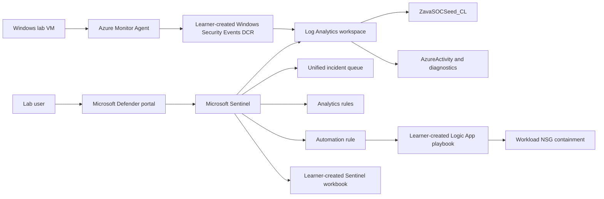

# Getting Started: Threat Triage Assistant

### Estimated Duration: 30 Minutes

## Scenario

Zava Corporation's small SOC team is overwhelmed by disconnected alert queues and repetitive investigation work. In this challenge lab, you are the SOC engineer responsible for using Microsoft Sentinel in the Microsoft Defender portal to unify alert triage, investigate the one true positive hidden among noisy incidents, tune false-positive detections, and automate containment of a Windows workload.

## Overview

1. You will work in an Azure sandbox that was prepared before your session begins.
2. Microsoft Sentinel is already enabled on the lab Log Analytics workspace; do not perform first-time Sentinel enablement.
3. Baseline Azure Activity, diagnostic data, seeded SOC records, analytics rules, and incidents are already present.
4. The incident queue intentionally contains many noisy incidents and one true-positive storyline for you to find during the lab.
5. Your primary SOC experience is the Microsoft Defender portal at <https://security.microsoft.com>, where Microsoft Sentinel provides SIEM capabilities, analytics rules, incidents, hunting, automation, and workbooks.
6. You may use the Azure portal at <https://portal.azure.com> when you need to inspect Azure resources such as the VM, Log Analytics workspace, data collection resources, Logic Apps workflows, or network security group.

## Objectives

1. Confirm access to the Azure subscription, Microsoft Defender portal, and lab resource group.
2. Identify the Sentinel-enabled Log Analytics workspace, Windows VM, virtual network, subnet, and network security group.
3. Confirm that seeded Microsoft Sentinel incidents already exist in the unified incident queue.
4. Understand the readiness baseline, naming conventions, and bounded retry approach used throughout the lab.
5. Record the UTC timestamp when you begin triage for later manual-versus-automated containment comparison.

## Sign in

1. Sign in to the Azure portal at <https://portal.azure.com> using the assigned lab identity.
2. Use this username: <inject key="AzureAdUserEmail"></inject>
3. Use this password: <inject key="AzureAdUserPassword"></inject>
4. Confirm that you are working in subscription <inject key="SubscriptionID"></inject> and tenant <inject key="TenantID"></inject>.
5. Sign in to the Microsoft Defender portal at <https://security.microsoft.com> with the same lab identity.
6. Keep both portals available during the lab; use Microsoft Defender for Sentinel operations and Azure portal only for Azure resource inspection or infrastructure changes.

> [!Important]
> Do not enable Security Copilot, create tenant-wide connectors, change subscription-wide policies, delete baseline lab resources, or broaden network exposure beyond the lab instructions.

## Architecture

## Lab components

1. **Resource group:** **<inject key="resourceGroupName"></inject>** contains the Azure resources for this lab deployment.
2. **Log Analytics workspace:** **<inject key="logAnalyticsWorkspaceName"></inject>** stores Azure Activity, diagnostic data, seeded SOC records, Windows Security Events after you connect them, Sentinel alerts, and incident metadata.
3. **Microsoft Sentinel workspace:** Sentinel is already enabled on the Log Analytics workspace and is managed primarily from the Microsoft Defender portal.
4. **Windows lab VM:** **<inject key="labVmName"></inject>** is the endpoint that generates fresh sign-in and failed-logon evidence during the lab.
5. **Virtual network and subnet:** locate the virtual network by the prefix **vnet-zava-soc-** and the subnet **snet-workload** in the lab resource group.
6. **Network security group:** **<inject key="networkSecurityGroupName"></inject>** is the scoped containment target for automated response.
7. **Seed table:** **ZavaSOCSeed_CL** contains structured benign-noise and true-positive scenario records used by baseline rules and investigation tasks.
8. **Baseline analytics rules:** **ZAVA-Noise-Repeated-Policy-Change**, **ZAVA-Noise-Administrative-Enumeration**, **ZAVA-Noise-Failed-Storage-Access**, and **ZAVA-TruePositive-Suspicious-VM-Access-And-NSG-Change** are already deployed and active.
9. **Benign noisy source:** account **svc-zava-audit@zavacorp.example** and source IP **198.51.100.23** are the known false-positive administrative enumeration values used later for tuning.
10. **Learner-created Windows Security Events DCR:** you will create or configure the DCR later with the deterministic name **dcr-zava-securityevents-<inject key="DeploymentID" enableCopy="false"/>**.
11. **Learner-created automation playbook:** you will build a Logic Apps workflow later using the required name prefix **la-zava-isolate-notify-** and connect it to Microsoft Sentinel automation.
12. **Learner-created reporting workbook:** you will build a Microsoft Sentinel workbook later. The visible workbook display name must start with **wb-zava-triage-report-**; the underlying Azure workbook resource name may be generated by the portal and does not need to match the display name exactly.
13. **Helper scripts on the VM:** the primary script folder is **C:\LabFiles\Scripts**. Useful scripts include **Generate-ZavaEndpointSignals.ps1**, **Start-ZavaManualContainmentTimer.ps1**, **Stop-ZavaManualContainmentTimer.ps1**, and **Reset-ZavaNSGContainment.ps1**. Copies may also be available on the Public Desktop for convenience.

> [!Important]
> NSG diagnostics are intentionally enabled for this lab so you can collect containment and timing evidence during later challenges. The diagnostic data is routed to the lab Log Analytics workspace and bounded by the 2 GB/day short-lab workspace cap. In Challenge 1, use the **Minimal** Windows Security Events set when you connect the VM. Do not choose **Common** or **All events** for this lab: those sets can generate enough SecurityEvent volume to hit the daily cap and can break later detections, workbook evidence, or validations.

## Readiness expectations

1. Expect the lab to begin from a ready SOC baseline, not from a blank Sentinel deployment.
2. Confirm that Microsoft Sentinel is already connected to the workspace; if you see onboarding or first-use prompts, pause and notify the facilitator instead of creating a new workspace.
3. Expect the incident queue to contain multiple low and medium severity noise incidents plus one true-positive case.
4. Expect the custom table **ZavaSOCSeed_CL** and Azure control-plane data to already have records before you start.
5. Expect to connect Windows Security Events from the lab VM later by using the Windows Security Events via AMA connector and the DCR named **dcr-zava-securityevents-<inject key="DeploymentID" enableCopy="false"/>**.
6. Expect event ingestion and incident creation to have short delays after you generate fresh activity; build retries into your workflow instead of assuming immediate results.

## Naming conventions

1. Use actual injected resource names from this guide when available. When an injected name is not provided, locate the resource in **<inject key="resourceGroupName"></inject>** by the prefix stated in the task.
2. Preserve all baseline resource names and rule names exactly as provided.
3. Name learner-created detections exactly as required later in the lab: **ZAVA-Learner-Failed-VM-Logons** and **ZAVA-Learner-Endpoint-And-Azure-Correlation**.
4. Name the learner-created Windows Security Events data collection rule **dcr-zava-securityevents-<inject key="DeploymentID" enableCopy="false"/>**.
5. Use the Logic App name prefix **la-zava-isolate-notify-** when you build the playbook.
6. Use the workbook visible display-name prefix **wb-zava-triage-report-** when you build the report; the Azure workbook resource name may be generated separately.
7. Name the quarantine NSG rule **Deny-Inbound-Zava-Quarantine**.
8. Use the exact incident tags and comment markers specified in each challenge, because validations rely on exact text matches.
9. If you need to refer to your CloudLabs deployment identifier outside a resource name, use <inject key="DeploymentID" enableCopy="false"/>.

## Bounded retry guidance

1. Use bounded time windows in KQL, such as the last 30 minutes for fresh activity and the last 48 to 72 hours for seeded baseline evidence.
2. When a query should return newly generated activity but does not, wait 2 minutes and retry the query.
3. Limit normal retries to 3 attempts before changing your troubleshooting approach.
4. If all retries fail, verify the data source, workspace scope, VM name, rule status, and time filter before regenerating activity.
5. For incident creation, allow analytics rule scheduling and alert-to-incident processing time before concluding that a rule failed.
6. Record the delay you observe when it affects your manual-versus-automated containment comparison.

## Start-of-lab checklist

1. In Azure, confirm that the lab subscription is <inject key="SubscriptionID"></inject>.
2. Locate the lab resource group **<inject key="resourceGroupName"></inject>**.
3. Identify the Log Analytics workspace **<inject key="logAnalyticsWorkspaceName"></inject>**.
4. Identify the Windows VM **<inject key="labVmName"></inject>**.
5. Identify the NSG **<inject key="networkSecurityGroupName"></inject>**.
6. Locate the virtual network with prefix **vnet-zava-soc-** in the lab resource group.
7. In the Microsoft Defender portal, confirm that Microsoft Sentinel is available and associated with the lab workspace.
8. Review the unified incident queue at **Investigation & response > Incidents & alerts > Incidents** and confirm that seeded incidents already exist.
9. Do not close, delete, or bulk-update incidents during this readiness check.
10. Record your triage start time in UTC in your notes using the format **yyyy-MM-dd HH:mm:ss UTC**.
11. Record the initial approximate number of open incidents and the highest severity visible in the queue.
12. Continue to Challenge 1 only after you can see the lab resources, the Sentinel workspace, and the pre-seeded incident queue.

## Summary

You signed in to the Azure and Microsoft Defender portals with the lab identity, confirmed that Microsoft Sentinel is already enabled and ready, identified the lab workspace, VM, network, NSG, seeded incident queue, and helper script location, and captured your triage start time for later containment-time comparison.
